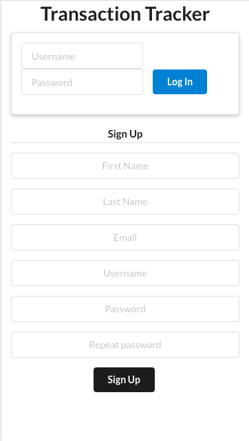
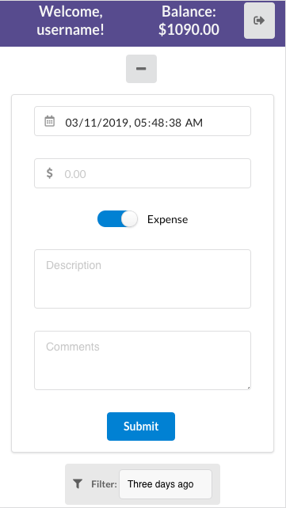
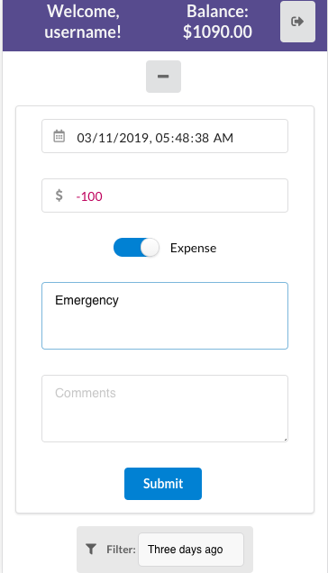
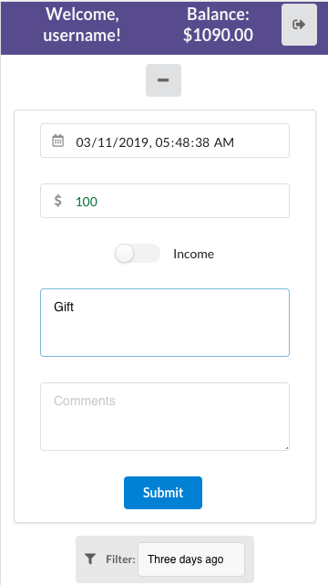
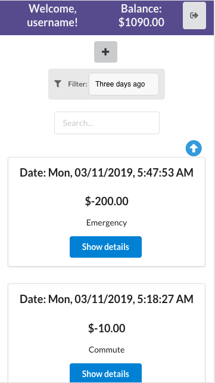
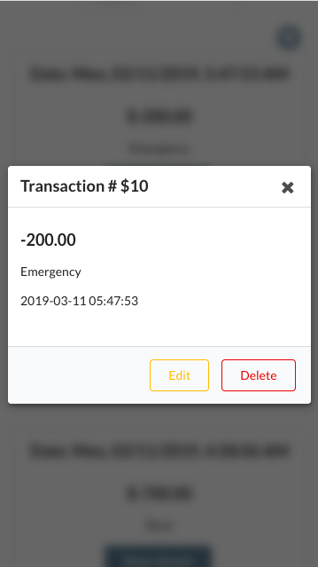
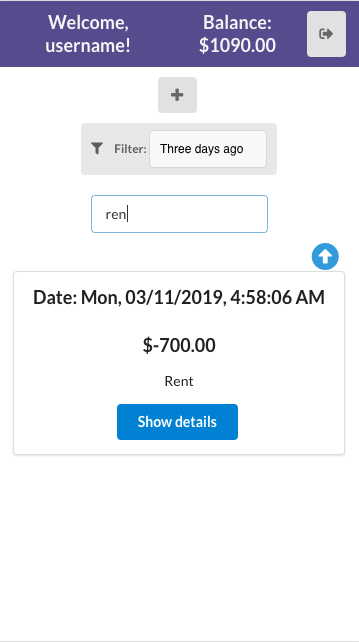

# Transaction Tracker

## Descripcion

This app keeps track of all expenses and incomes and see the balance you have at the moment.

## Feature

- User creation.
- User login.
- Transaction creation, deletion, and updating.
- Balance tracker of the user.
- Quick filter by time.
- Search box allowing to filter by description, date, or amount.
- Modern design.
- Responsive design.

## Link

https://transac-tracker.herokuapp.com/

## How to use it

- Create an account or use **username** as username and **12345** as password for demo porpuses.

#### Create a new transaction:

- Click on the **+** button to create a new transaction.
- Select the date or use default.
- Select the amount. By default, would be negative, meaning it is an _expense_.
- To change it to _income_ change the **switch** checkbox below.
- Add a description.
- Add a comment (optional).
- Click on **submit** button.
- Your transaction will appear below.

#### See transaction details

- Just click on the **see details** button on the transaction.

#### Delete

- In the details box, click on the **delete** button.
- Confirm in the dialog box.
- Your transaction will dissapear.

#### Edit

- In the details box, click on the **edit** button.
- The information will appear in the form to be edited.
- Click **submit** when you finish

### Filters

#### Time

- By default the app will show the transactions from _three days ago_.
- This can be change in the **select** box with the filter icon.

#### Search

- The **search** box is used to find by _date_, _description_ or _amount_
- If it is empty, it will show all the transactions.

## Screenshots

---

---

---

---

---

---

